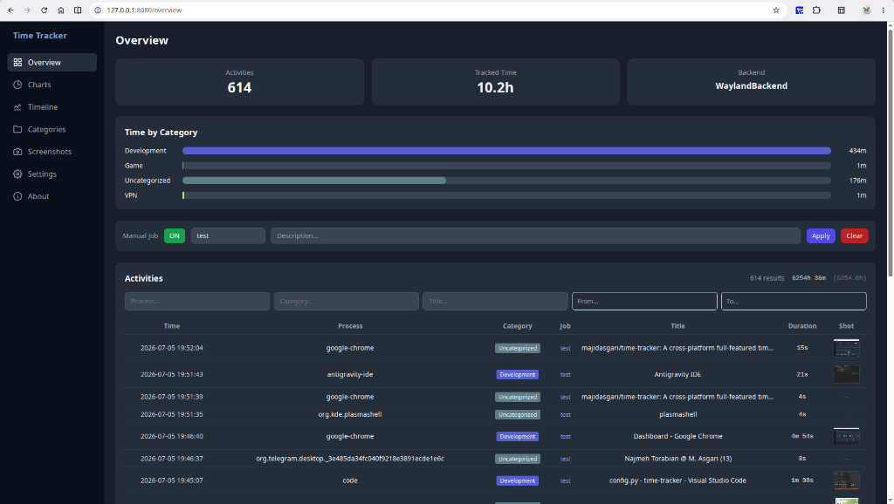
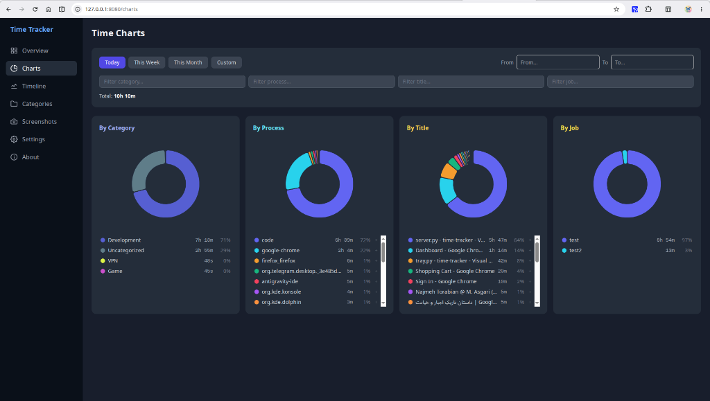
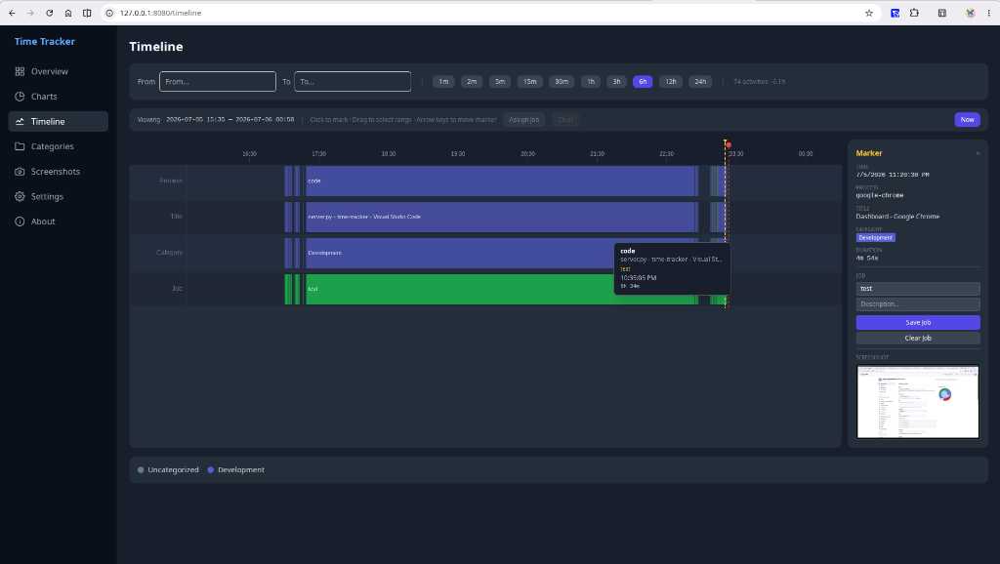
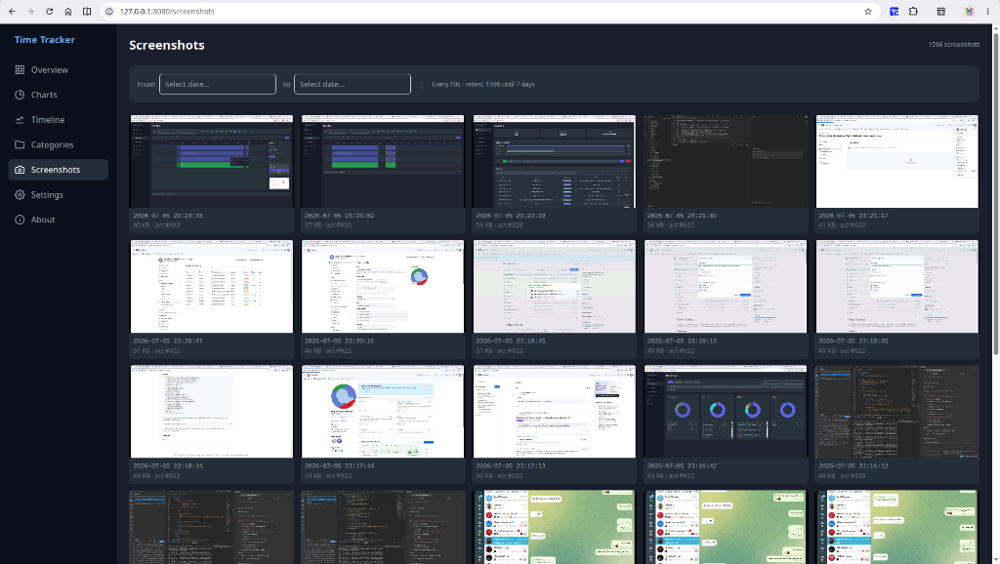
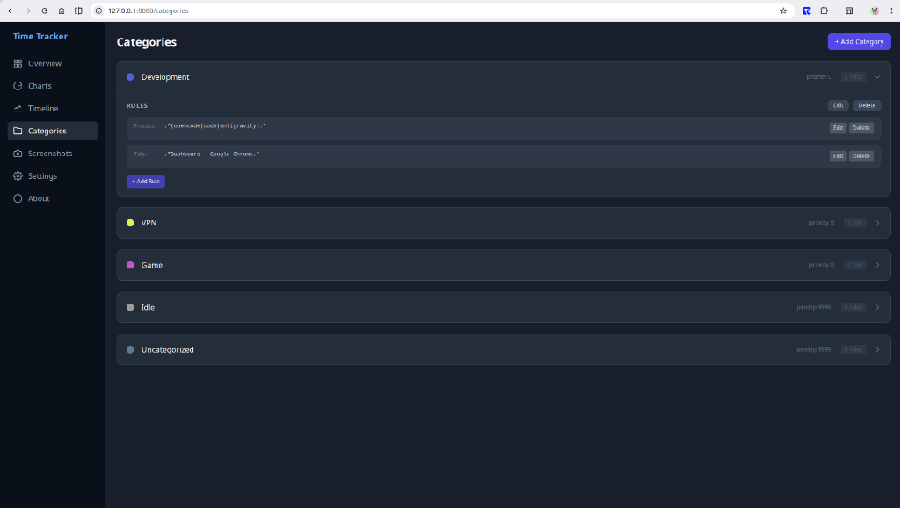
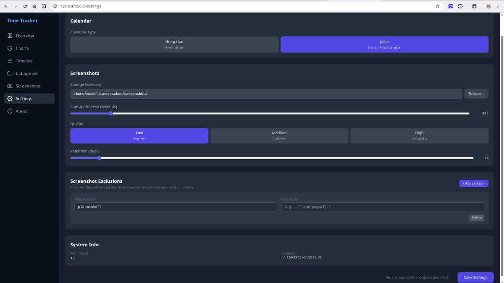

# Chrysalis Time Tracker

<p align="center">
  
</p>

A cross-platform desktop time tracker (Windows + Linux KDE) that records and categorizes user activity using an event-based approach. All data is stored **entirely locally** (SQLite) — no data is ever sent over the network.

## Features

### Smart Activity Tracking
- **Event-based:** records are only created when the active window changes (not constant polling) — lightweight, accurate, low data volume
- **Auto Idle detection:** when no window is focused or the system is locked, activity is logged as `Idle`
- **Process + title storage:** each record includes process name, window title, and start/end timestamps

### Regex-Based Categorization
- **Categories:** tree structure with name, color, priority, and enabled/disabled status
- **Rules:** regex patterns on `process` and `title` — AND logic within a rule, OR across rules in the same category
- **Priority-based matching:** the first matching category (by priority) wins
- **Auto recompute:** changing rules increments the rule version; a background worker chunk-by-chunk re-categorizes the entire history
- **Uncategorized:** activities matching no rule fall into `Uncategorized`

### Periodic Screenshots
- **Configurable interval:** 1–300 seconds (default: 10s)
- **Three quality levels:** Low (30% JPEG) / Medium (60%) / High (90%) — each with appropriate resolution
- **Retention management:** auto-delete old screenshots (1–90 days)
- **Spectacle detection (KDE):** screenshot capture pauses while the user is using KDE's Spectacle tool
- **Preview:** screenshot gallery in the dashboard with full-size lightbox

### Integrated Dashboard (Angular)

- **Overview:** activity table with filters (process, category, title, date range) + category time breakdown + pagination
  

- **Charts:** Pie/Donut charts by category/process/title — preset ranges: Today / This Week / This Month / Custom
  

- **Timeline:** Gantt-like visual display with 4 rows (process, title, category, job) — scroll-to-zoom, drag-to-pan, range selection, marker with details and screenshot
  

- **Screenshots:** gallery with date range filter and full-size preview
  

- **Categories:** full CRUD for categories and rules + recompute on rule change
  

- **Settings:** configure calendar type (Gregorian/Jalali), screenshot storage, capture interval, quality, retention days, window exclusions, and system info
  


### Dual Calendar Support
- **Dual date picker:** supports both Gregorian and Jalali (Persian Solar Hijri) calendars
- **Settings toggle:** user selects calendar type in Settings; all date pickers follow the selection
- **Gregorian equivalent:** when Jalali is active, the Gregorian equivalent is shown below each date picker
- **No backend changes needed:** all dates in the API and database remain Gregorian

### Job Tracking
- **Manual Job:** assign a job via the system tray or dashboard — all subsequent activities are tagged with that job
- **Inline Editing:** edit an activity's job directly in the Overview table
- **Range Assignment:** assign a job to a time range in the Timeline (drag-select)
- **Autocomplete:** previous job suggestions while typing

### System Tray
- **Clock icon:** shows tracking status (active/paused) with tooltip
- **Context menu:** open dashboard, pause/resume tracking, set manual job, quit
- **Double-click:** quick launch dashboard in browser

### Privacy
- **All data is local:** SQLite on the user's disk, no network communication (except `localhost:8080` for the dashboard)
- **Exclusion list:** sensitive apps can be excluded from screenshots (via config)
- **No telemetry:** no data is collected or transmitted

### Cross-Platform
| Platform | Window Detection | Screenshot |
|---|---|---|
| Windows 10/11 | Win32 API (ctypes) | mss / BitBlt |
| Linux X11 | python-xlib | mss |
| Linux Wayland (KDE) | DBus → KWin | spectacle --background |

## Tech Stack

| Layer | Technology |
|---|---|
| Backend | Python 3.11+ / PySide6 / FastAPI / SQLModel (SQLite WAL) |
| Dashboard | Angular 19 / ECharts / TailwindCSS |
| Platform | ctypes (Windows) / python-xlib (X11) / DBus → KWin (Wayland) |
| Screenshots | mss / Pillow / spectacle / grim |
| Date Picker | asa-date-picker (Gregorian + Jalali) |

## Project Structure

```
├── src/timetracker/
│   ├── __main__.py           # Entry point
│   ├── config.py             # TOML config loading/saving
│   ├── platform/             # Platform abstraction layer
│   │   ├── base.py           # WindowInfo interface
│   │   ├── factory.py        # Auto-select backend
│   │   ├── linux_x11.py      # X11 via python-xlib
│   │   ├── linux_wayland.py  # Wayland KDE via DBus
│   │   └── windows.py        # Win32 API via ctypes
│   ├── db/                   # Models, session, migrations
│   ├── tracking/             # Sampler + categorizer + recompute
│   ├── screenshots/          # Capture + retention
│   ├── api/                  # FastAPI routes
│   └── ui/                   # System tray + dashboard window
├── dashboard/                # Angular project
├── tests/                    # Python tests
├── docs/                     # Documentation (SPEC, PLAN)
└── scripts/                  # Helper scripts
```

## Getting Started (from source)

```bash
# Clone
git clone https://github.com/majidasgari/time-tracker
cd time-tracker

# Python virtual environment
python3 -m venv .venv
source .venv/bin/activate
pip install -e ".[dev]"

# Platform-specific dependency (install only one)
pip install -e ".[x11]"        # Linux X11
pip install -e ".[wayland]"    # Linux KDE Wayland
pip install -e ".[win32]"      # Windows

# Angular dashboard
cd dashboard
npm install
npm run build
cd ..

# Run
python -m timetracker
```

The dashboard is available at `http://127.0.0.1:8080` and opens in the default browser. Double-click the system tray icon to reopen it.

## Building a Linux Executable

### Prerequisites

```bash
# System packages (Ubuntu/Debian)
sudo apt install libdbus-1-dev python3-dev

# Python virtual environment
python3 -m venv .venv
source .venv/bin/activate
pip install -e ".[dev,wayland]"    # or .[dev,x11] for X11
```

### Step 1: Build the Angular dashboard

```bash
cd dashboard
npm install
npm run build
cd ..
```

### Step 2: Build with PyInstaller

```bash
pyinstaller \
  --name=time-tracker \
  --onedir \
  --add-data "dashboard/dist/dashboard/browser:dashboard/dist/dashboard/browser" \
  --hidden-import timetracker.config \
  --hidden-import timetracker.db.models \
  --hidden-import timetracker.db.migrations \
  --hidden-import timetracker.db.session \
  --hidden-import timetracker.api.server \
  --hidden-import timetracker.api.routes.categories \
  --hidden-import timetracker.api.routes.config \
  --hidden-import timetracker.api.routes.jobs \
  --hidden-import timetracker.api.routes.screenshots \
  --hidden-import timetracker.api.routes.tracking \
  --hidden-import timetracker.api.routes.stats \
  --hidden-import timetracker.platform.base \
  --hidden-import timetracker.platform.factory \
  --hidden-import timetracker.platform.linux_x11 \
  --hidden-import timetracker.platform.linux_wayland \
  --hidden-import timetracker.screenshots.capture \
  --hidden-import timetracker.tracking.categorizer \
  --hidden-import timetracker.tracking.recompute \
  --hidden-import timetracker.tracking.sampler \
  --hidden-import timetracker.ui.tray \
  --hidden-import psutil \
  --hidden-import PIL \
  --hidden-import PIL.Image \
  --hidden-import mss \
  --hidden-import regex \
  --hidden-import uvicorn \
  --hidden-import uvicorn.loops \
  --hidden-import uvicorn.loops.auto \
  --hidden-import uvicorn.protocols \
  --hidden-import uvicorn.protocols.http \
  --hidden-import uvicorn.protocols.http.auto \
  --hidden-import uvicorn.protocols.utils \
  --hidden-import sqlmodel \
  --hidden-import pydantic \
  --hidden-import starlette \
  --hidden-import fastapi \
  --noconsole \
  src/timetracker/__main__.py
```

The output is at `dist/time-tracker/time-tracker` (not `build/time-tracker/` — that directory contains intermediate build files only).

```bash
./dist/time-tracker/time-tracker
```

> **Note:** PySide6 + QWebEngineView binaries are large. The final `dist/time-tracker/` directory is approximately **210 MB**.

## License

MIT
